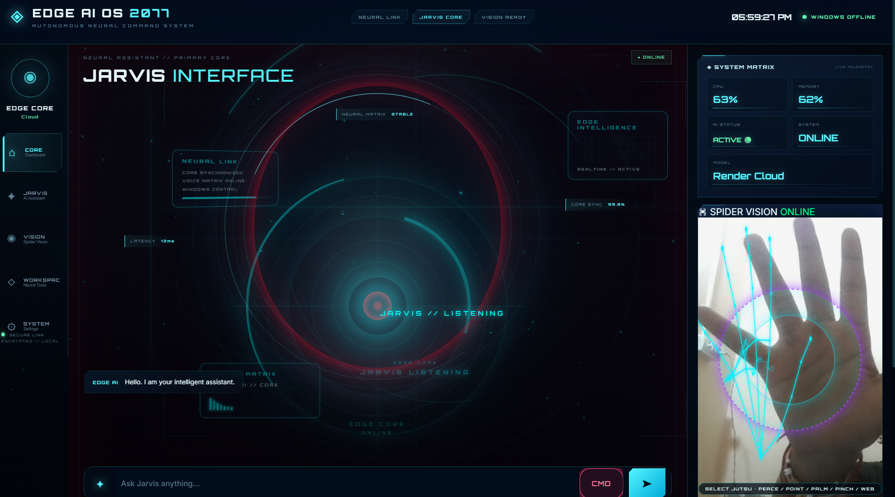

# ⚡ EDGE AI OS 2077

## J.A.R.V.I.S. Neural Command System

> A futuristic AI assistant combining conversational intelligence, voice interaction, computer vision, gesture recognition, browser automation, and Windows system control inside an immersive neural HUD.

---
## 🖥️ EDGE AI OS 2077 — Interface



---

## 🌐 Live Demo

### 🚀 Try EDGE AI OS 2077

https://jarvis-ai-dsmz.onrender.com/

The public version can be accessed from mobile phones, laptops, tablets, and other internet-connected devices.

---

## 🧠 About EDGE AI OS 2077

**EDGE AI OS 2077** is a JARVIS-inspired artificial intelligence system designed as an interactive AI workspace rather than a traditional chatbot.

The project combines an AI conversational engine with natural-language command processing, voice interaction, computer vision, hand-gesture recognition, browser automation, Windows control, and a futuristic HUD interface.

The system operates in two modes:

### 🌐 Public Web Mode

The publicly deployed version provides:

- AI conversation
- Natural-language interaction
- Browser commands
- Website launching
- Google search
- YouTube search
- Google Maps integration
- Voice interaction
- Futuristic neural HUD

### 💻 Local Windows Mode

When running locally on Windows, EDGE AI OS can additionally interact with the operating system and execute supported desktop actions.

---

# 🚀 Core Features

## 🧠 AI Intelligence

- Gemini-powered conversational intelligence
- Natural-language understanding
- Intelligent command routing
- AI conversation mode
- Action detection
- Command normalization
- Hybrid AI + system architecture

---

## 🎙️ JARVIS Voice System

EDGE AI OS includes browser-based voice recognition.

Supported interaction includes:

```text
Hey Jarvis